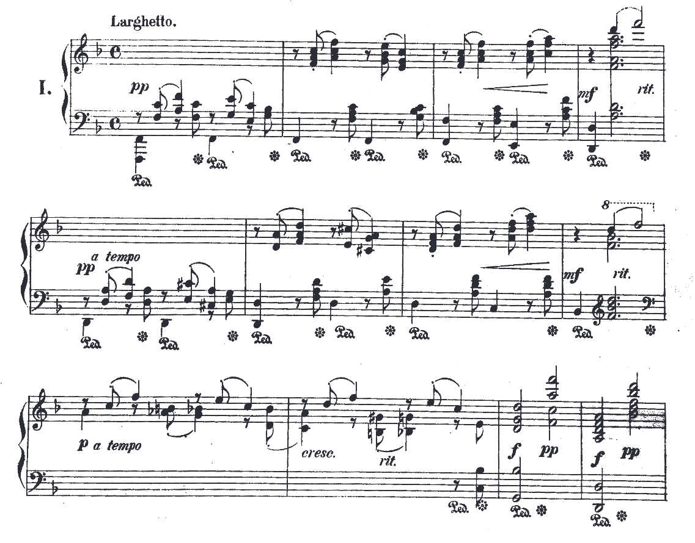
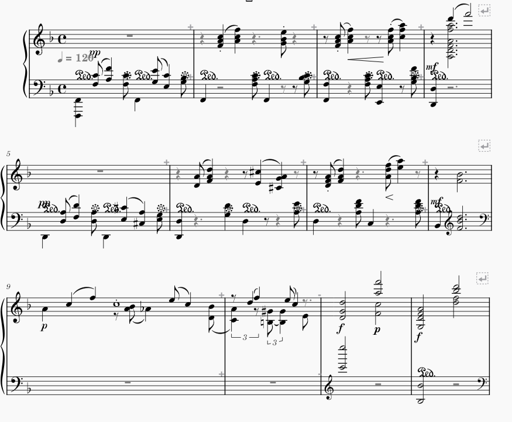
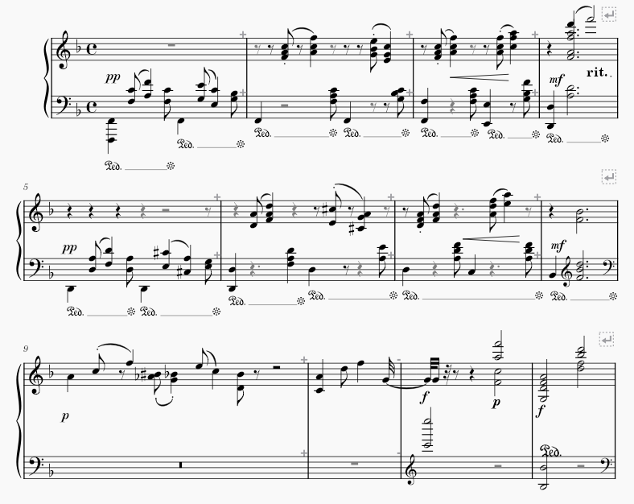
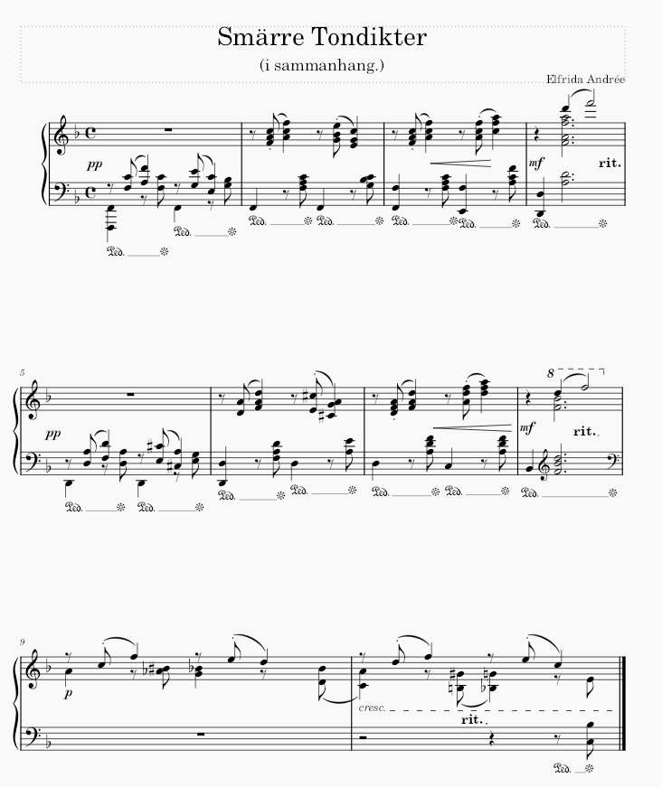

<head>
    <title>Week 2 | MCA</title>
</head>

    
    <ul class="menu">
    <li><a href="../">Back to index</a></li>
    <li><a href="week1.html">Week 1</a></li>
    <li><a href="week2.html">Week 2</a></li>
    <li><a href="week3.html">Week 3</a></li>
    <li><a href="week4.html">Week 4</a></li>
    <li><a href="week5.html">Week 5</a></li>
    <li><a href="week7.html">Week 7</a></li>
    <li><a href="week8.html">Week 8</a></li>
    <li><a href="week9.html">Week 9</a></li>
    <li><a href="week10.html">Week 10</a></li>
</ul>

1. <i>Identify a piece of music to download and edit</i>

I have chosen ["Fem smärre Tonbilder (i sammanhang)"](https://www.swedishmusicalheritage.com/composers/andree-elfrida/SMH-W1200-Fem_smarre_tonbilder_i_sammanhang_Five_smaller_tone_paintings/) by Elfrida Andrée.

2. <i>Download and convert PDF</i>

3. <i>Edit at least 10 bars in MuseScore</i>

4. Immediately, MuseScore did not like the file it had OMR-ed when it gave me a "corrupted file" error. Specifically, it said "Voice too long: Full score, measure 10, staff 1, voice 3. Fount 8/12. Expected 42/64".

I am not an expert at the "music bit" but I get the feeling that there is something catastrophically wrong with the OMR process of this piece, as there are rests galore where i'm pretty sure there shouldn't be. I'm not sure what the quaver rests are doing under quavers (notes) but i have a feeling that the OMR was confised by that, along with the repeated pedal markers. 

Furthermore, the rather large amount of tone and tempo markers between the staves possibly made it difficult to discern any reasonable information. The main issue is that the converted file seems to think there needs to be more notes per bar, which is not an issue that's ever come up before.

The most consistent error was the pedal markings, that seemed to be placed inside the notes.

<i>Most</i> of the notes were transcribed correctly with some exceptions, most notably in bar 4.

In general, I cant really discern any major trends beyond that.

<i>N.B.</i>
I spent some time trying to figure out what the issue was, turns out the piece was employing two voices, something I was not aware was a thing. Upon udnerstanding that, the errors of the OMR were even more apparent and honestly beyond repair. I thus remade the first 10 bars for use in the later week.

