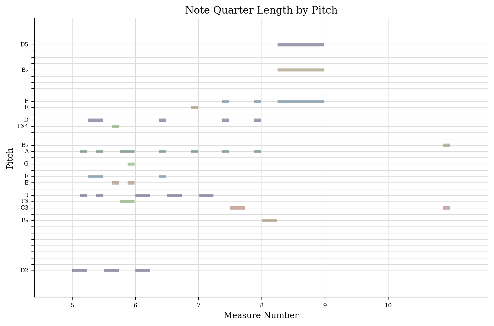
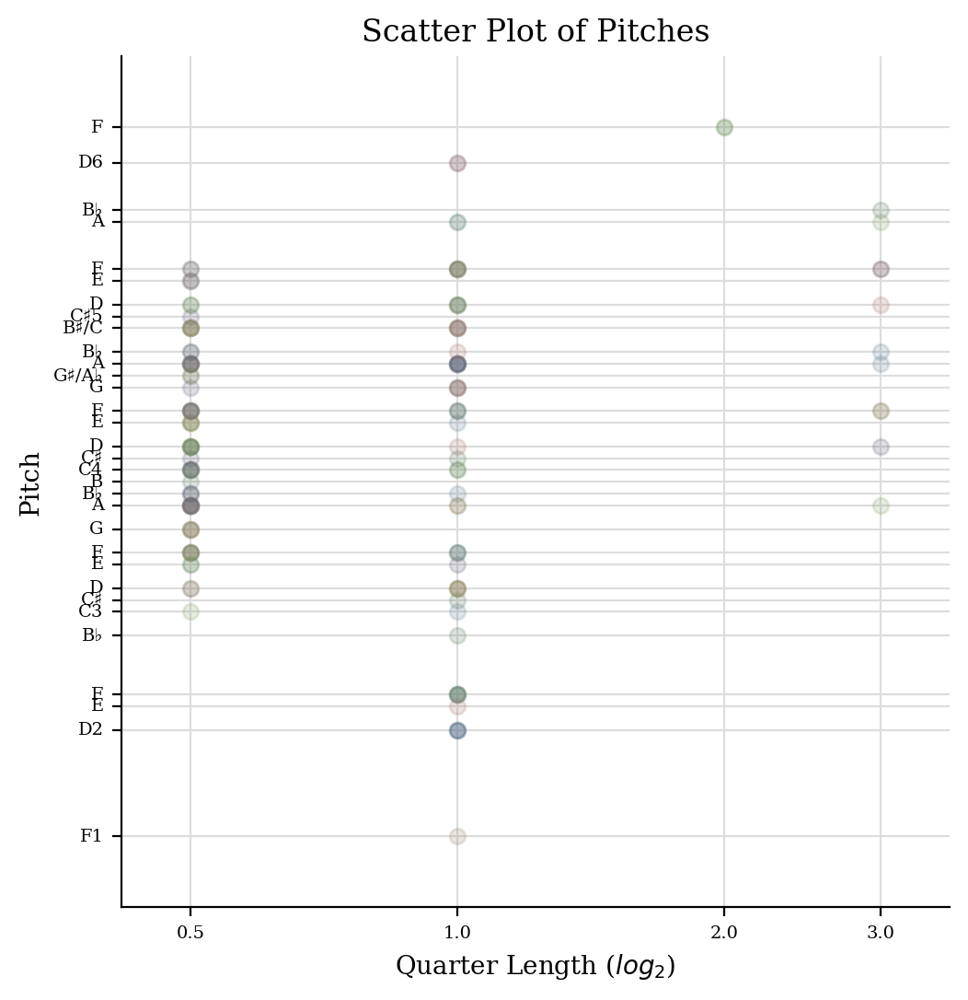
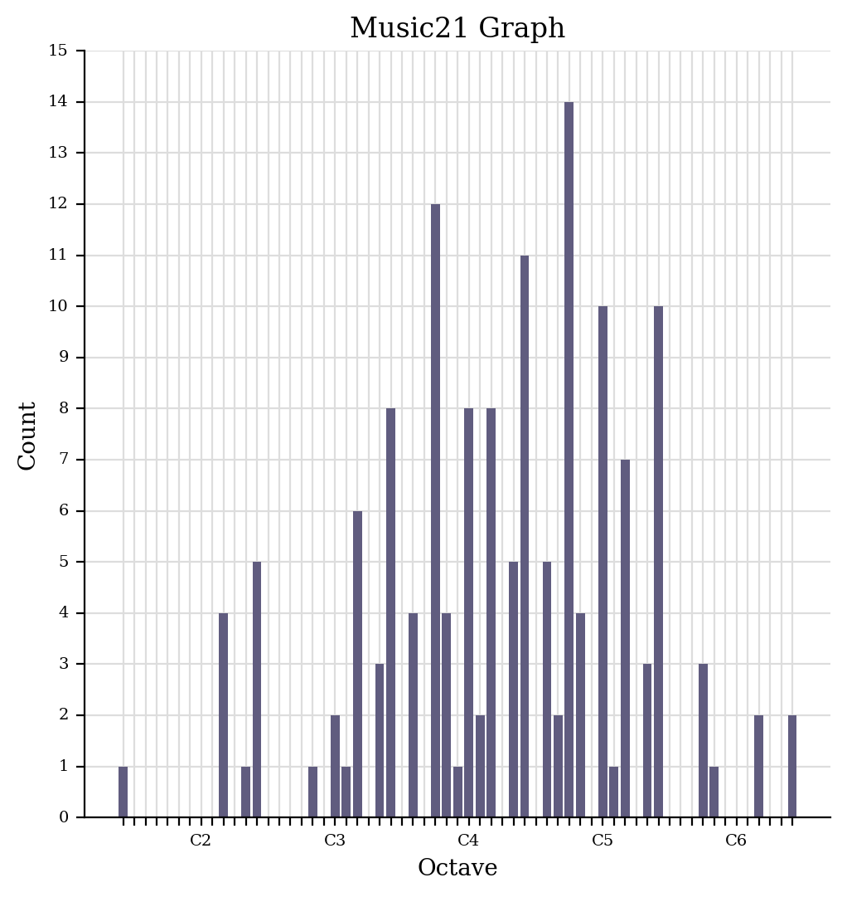

<head>
    <title>Week 4 | MCA</title>
</head>

    
    <ul class="menu">
    <li><a href="../">Back to index</a></li>
    <li><a href="week1.html">Week 1</a></li>
    <li><a href="week2.html">Week 2</a></li>
    <li><a href="week3.html">Week 3</a></li>
    <li><a href="week4.html" class="sel">Week 4</a></li>
    <li><a href="week5.html">Week 5</a></li>
    <li><a href="week7.html">Week 7</a></li>
    <li><a href="week8.html">Week 8</a></li>
    <li><a href="week9.html">Week 9</a></li>
    <li><a href="week10.html">Week 10</a></li>
</ul>

1. Generate a jSymbolic Analysis

2. Use the Python notebook to generate various plots and graphs   More detailed information in the intro to music21.ipynb document, but the main generated content is displayed below.

[Link to download Python Notebook](../Intro%20to%20music21.ipynb)

This figure depicts the evolution of pitches throughout the piece of music. In my opinion this is the clearest visualization of the two voices, with two different trends emerging clearly arrund measures 7-9.

This figure shows the distribution of note duration compared to the pitch. I'm not sure what the plot shows in terms of the music. Potentially an extrapolation can be made considering the greater amount of "shorter" notes that the piece is played at a faster tempo, but we know this is not the case as the movement is played in larghetto.

This shows the distribution of notes played at various pitches. It shows that the majority of notes played center around middle C or slightly higher.