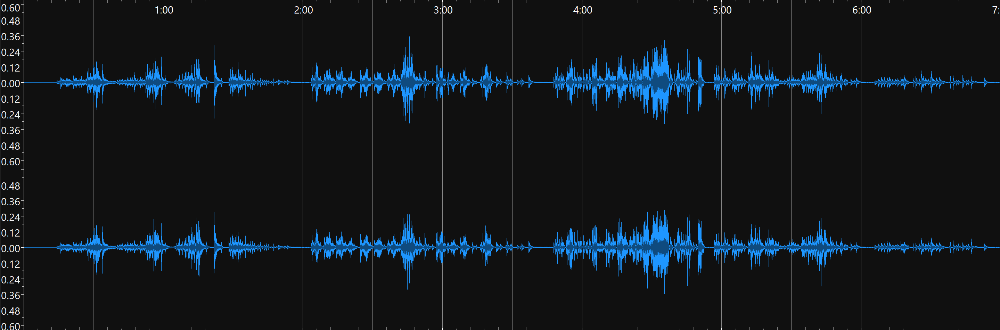

<head>
    <title>Week 8 | MCA</title>
</head>

    
    <ul class="menu">
    <li><a href="../README.html">Back to index</a></li>
    <li><a href="week1.html">Week 1</a></li>
    <li><a href="week2.html">Week 2</a></li>
    <li><a href="week3.html">Week 3</a></li>
    <li><a href="week4.html">Week 4</a></li>
    <li><a href="week5.html">Week 5</a></li>
    <li><a href="week7.html">Week 7</a></li>
    <li><a href="week8.html">Week 8</a></li>
    <li><a href="week9.html">Week 9</a></li>
    <li><a href="week10.html">Week 10</a></li>
</ul>

# Task 1
Ideintifying important technical and non-technical metadata associated with each track.

| **Title**| **Subtitle**| **Composer** | **Artist** | **Singer** | **Category** | **Key** | **Number of Channels** | **Sample Rate (Hz)** | **Bit Rate (Kbps)** | **Duration** | **Date** | **File Format** |
|-|-|-|-|-|-|-|-|-|-|-|-|-|
| Tullgarn's Galopp || Princess Eugénie Bernadotte | Árpád Solti|| Piano| B-flat major | 2 | 48000 | 192 | 1:56 | 1853 | MP3 |
| Fem Smärre Tonbilder | (i sammanhang) | Elfrida Andrée | Oskar Ekberg || Piano | Multiple | 2 | 48000 | 192 | 6:59 | 1880 | MP3 |
| Trastens Klagan || Laura Netzel | Michael Engström | Josefine Mindus | Voice and Piano | F major | 2 | 48000 | 192 | 1:40 | 1889 | MP3 |

# Task 2

A time-frequency analysis can aid in understanding the contents of an audio file through comparison and visual analysis. For instance, track three's time-frequency analysis makes it clear that there is a voice at play, while the waveform does not immediately make that clear. 

## Tullgarn's Galopp
Waveform:

Spectro:

## Smärre Tonbilder
Waveform:

Spectro:

## Trastens Klagan
Waveform:

Spectro:
